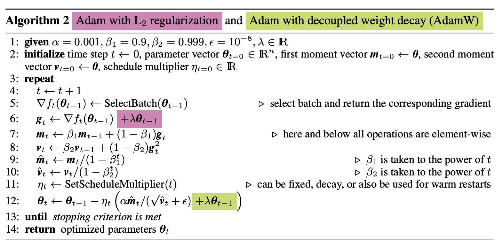
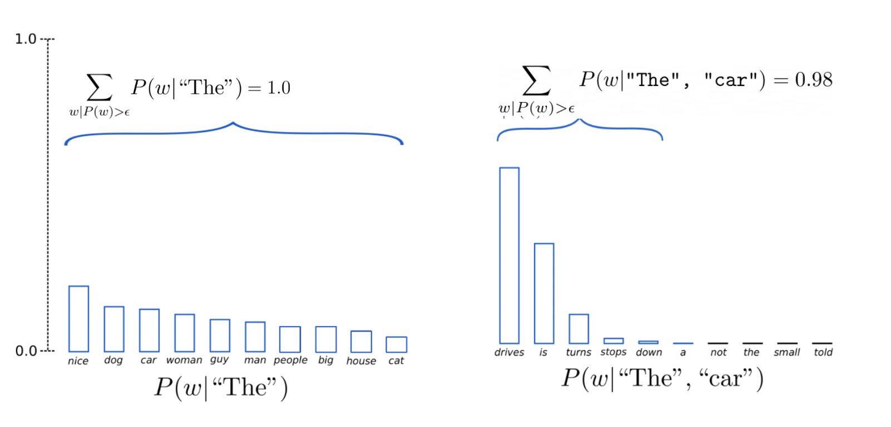

# MMIA-NLP CLass Project

## Build a Mini-Llama, a minimalist version of Llama2.

## Overview

In this assignment, you will implement important components of the Llama2 model to better understand its architecture. You will then perform sentence classification on the SST and CFIMDB datasets with this model.

## Assignment Details

### Your Tasks

You are responsible for implementing core components of Llama2 in the following files:
- `llama.py` - Main model architecture
- `classifier.py` - Classification head
- `optimizer.py` - AdamW optimizer  
- `rope.py` - Rotary position embeddings
- `lora.py` - LoRA implementation

You will work with `stories42M.pt`, an 8-layer, 42M parameter language model pretrained on the [TinyStories](https://arxiv.org/abs/2305.07759) dataset (machine-generated children's stories). This model is small enough to train with a small GPU.

### Background Theory

1. **LayerNorm (Layer Normalization)**
In this assignment, we will use LayerNorm instead of RMSNorm (which is used in Llama2). You will implement LayerNorm in llama.py. This normalization operates across features for each data point, reducing internal covariate shift, stabilizing gradients, and accelerating training.

$$
\hat{a}_i = \frac{a_i - \mu}{\sigma} g_i
$$

Here, $$\hat{a}_i$$ is the normalized input, $$g$$ is a learnable gain, and $$\mu$$, $$\sigma$$ are the mean and standard deviation of inputs a:

$$\mu = \frac{1}{n} \sum_{i=1}^{n} a_i, \quad 
    \sigma = \sqrt{\frac{1}{n} \sum_{i=1}^{n} (a_i - \mu)^2}.$$

LayerNorm makes activations independent of input scale and weights to improve stability.

Reference: Layer Normalization (Ba et al., 2016)

2. **Scaled Dot-Product Attention and Grouped Query Attention**
Scaled Dot-Product Attention is the fundamental building block of the Transformer architecture (Vaswani et al., 2017). It computes attention scores by comparing queries (Q) with keys (K). These scores determine how much focus each token should place on other tokens, and are then used to weight the values (V). To prevent large dot products from destabilizing training, the scores are scaled by the square root of the key dimension before applying the softmax function. In this assignment, you will implement the scaled dot-product attention mechanism in the function compute_query_key_value_scores within llama.py. In self-attention, the same input embeddings X are projected into queries (Q), keys (K), and values (V) using learned weight matrices (WQ, WK, WV). These separate projections allow the model to learn different views of each token depending on whether it is acting as a query, a key, or a value. Once Q, K, and V are obtained, the self-attention mechanism compares every query with all keys to produce attention scores, which are then used to weight the corresponding values.

3. **RoPE Embeddings (Rotary Positional Embeddings)**
   
Rotary Positional Embeddings (RoPE) are currently used in LLMs such as Llama. The technique employs a rotation matrix with a hyperparameter theta to rotate key and query vectors based on their position in a sequence, encoding positional information by rotating token embeddings in 2D space. In this assignment, you will implement RoPE in the function apply_rotary_emb within rope.py.

5. **LoRA Low-Rank Adaptation**
   
The basic idea of LoRA is to add low-rank matrices with dimensions smaller than the original weight matrix, training only these LoRA adaptors instead of the entire model. After training, these adaptors are added to the original weight matrix. These low-rank matrices have reduced dimensions, and when multiplied after training, they match the original weight matrix's dimensions, allowing straightforward addition.

For a pre-trained weight matrix W₀ ∈ ℝᵈˣᵏ, LoRA constrains the update by representing it with a low-rank decomposition: W₀ + ΔW = W₀ + BA, where B ∈ ℝᵈˣʳ, A ∈ ℝʳˣᵏ, and the rank r ≪ min(d, k). During training, W₀ is frozen while A and B contain trainable parameters.

The modified forward pass becomes: h = W₀x + ΔWx = W₀x + BAx. LoRA output BAx is scaled by α/r before being added to the original output, where α is a constant and r is the rank. This gives us the final computation: h = W₀x + (α/r) × BAx.

In transformer architectures, LoRA adaptors are typically injected into the Query and Value weight matrices. The rank R is usually set to 16, 8 or 4, depending on the model size and fine-tuning task. For larger models or more challenging tasks, R can be increased to 64 or higher. In this assignment, you will implement LoRALayer within lora.py.

6. **AdamW Optimizer**
   
AdamW is an improved version of the Adam optimizer that decouples weight decay from gradient-based updates, leading to better regularization and improved generalization performance in transformer models. This optimizer is widely used in training large language models due to its superior convergence properties. In this assignment, you will implement the AdamW algorithm (Algorithm 2 in Loshchilov & Hutter, 2017, shown below) inside the optimizer.py.

<p align="center">

</p>

7. **Epsilon Sampling Decoding**
   
Epsilon sampling is a text generation strategy that filters out tokens with probability below a fixed threshold (ε), then samples from the remaining tokens. This approach provides a simple yet effective way to balance diversity and quality in generated text by removing very low-probability tokens that might lead to incoherent outputs. You will implement epsilon sampling in the function generate within llama.py.

<p align="center">

</p>

## Tasks and Datasets

After implementing the core components from Part 1 (attention mechanisms, feed-forward networks, layer normalization, RoPE, optimizer, and LoRA), you will test your model across three main tasks: (1) text continuation where you'll complete prompts to produce coherent continuations, (2) sentiment classification on two movie review datasets - the Stanford Sentiment Treebank (SST) for 5-class sentiment analysis of single sentences from movie reviews, and CFIMDB for binary sentiment classification of full movie reviews, and (3) evaluation across three settings - zero-shot prompting (using the pretrained model directly with crafted prompts), full fine-tuning (adapting the entire model through gradient updates), and LoRA fine-tuning (parameter-efficient adaptation using low-rank matrices). You'll measure performance through classification accuracy on the sentiment tasks.

## Testing Your Implementation

Once you have implemented the components, you will test your model in four settings:

1. **Text Generation**: Generate completions starting with: *"Victor Frankenstein, a young scientist obsessed with uncovering the secrets of life, succeeds in animating a creature assembled from"*. You should see coherent, grammatical English (though content may be absurd due to the children's stories training data).

2. **Zero-shot Prompting**: Perform prompt-based sentiment analysis on SST-5 and CFIMDB datasets. This will give poor results (roughly random performance).

3. **Fine-tuning**: Perform task-specific fine-tuning with a classification head. This will give much stronger results.
4. **LoRA Fine-tuning**: Perform task-specific LoRA fine-tuning with a classification head.

Refer to the checklist.md file. 

## Important Notes

- Follow `setup.sh` to properly set up the environment and install dependencies
- See [structure.md](./structure.md) for detailed code structure descriptions
- Use only libraries installed by `setup.sh` - no external libraries (`transformers`) allowed
- The `data/cfimdb-test.txt` file contains placeholder labels (-1), so test accuracies may appear low
- Ensure reproducibility using the provided commands
- Do not change existing command options or add new required parameters
- Refer to [checklist.md](./checklist.md) for assignment requirements

## Reference Commands and Expected Results

### Text Generation
```bash
python run_llama.py --option generate
```
You should see continuations of the sentence `Victor Frankenstein, a young scientist obsessed with uncovering the secrets of life, succeeds in animating a creature assembled from...`. We will generate two continuations - one with temperature 0.0 (which should have a reasonably coherent, if unusual, completion) and one with temperature 1.0 (which introduces randomness for more creative and diverse outputs, though potentially less coherent).


### Zero-Shot Prompting

**SST Dataset:**
```bash
python run_llama.py --option prompt --batch_size 10 --train data/sst-train.txt --dev data/sst-dev.txt --test data/sst-test.txt --label-names data/sst-label-mapping.json --dev_out sst-dev-prompting-output.txt --test_out sst-test-prompting-output.txt [--use_gpu]
```
- Dev Accuracy: 0.237 (0.000)
- Test Accuracy: 0.250 (0.000)

**CFIMDB Dataset:**
```bash
python run_llama.py --option prompt --batch_size 10 --train data/cfimdb-train.txt --dev data/cfimdb-dev.txt --test data/cfimdb-test.txt --label-names data/cfimdb-label-mapping.json --dev_out cfimdb-dev-prompting-output.txt --test_out cfimdb-test-prompting-output.txt [--use_gpu]
```
- Dev Accuracy: 0.490 (0.000)
- Test Accuracy: 0.109 (0.000)

### Classification Fine-tuning

**SST Dataset:**
```bash
python run_llama.py --option finetune --epochs 5 --lr 2e-5 --batch_size 80 --train data/sst-train.txt --dev data/sst-dev.txt --test data/sst-test.txt --label-names data/sst-label-mapping.json --dev_out sst-dev-finetuning-output.txt --test_out sst-test-finetuning-output.txt [--use_gpu]
```
- Dev Accuracy: 0.411 (0.025)
- Test Accuracy: 0.399 (0.023)

**CFIMDB Dataset:**
```bash
python run_llama.py --option finetune --epochs 5 --lr 2e-5 --batch_size 10 --train data/cfimdb-train.txt --dev data/cfimdb-dev.txt --test data/cfimdb-test.txt --label-names data/cfimdb-label-mapping.json --dev_out cfimdb-dev-finetuning-output.txt --test_out cfimdb-test-finetuning-output.txt [--use_gpu]
```
- Dev Accuracy: 0.833 (0.060)
- Test Accuracy: 0.473 (0.198)

### LoRA Fine-tuning

**SST Dataset:**
```bash
python run_llama.py --option lora --epochs 5 --lr 2e-5 --batch_size 80 --train data/sst-train.txt --dev data/sst-dev.txt --test data/sst-test.txt --label-names data/sst-label-mapping.json --dev_out sst-dev-lora-output.txt --test_out sst-test-lora-output.txt --lora_rank 4 --lora_alpha 1.0 [--use_gpu]
```
- Dev Accuracy: 0.275 (0.024)
- Test Accuracy: 0.269 (0.020)

**CFIMDB Dataset:**
```bash
python run_llama.py --option lora --epochs 5 --lr 2e-5 --batch_size 10 --train data/cfimdb-train.txt --dev data/cfimdb-dev.txt --test data/cfimdb-test.txt --label-names data/cfimdb-label-mapping.json --dev_out cfimdb-dev-lora-output.txt --test_out cfimdb-test-lora-output.txt --lora_rank 4 --lora_alpha 1.0 [--use_gpu]
```
- Dev Accuracy: 0.510 (0.051)
- Test Accuracy: 0.506 (0.239)

*Note: Mean reference accuracies over 10 random seeds with standard deviations in brackets.*

### Submission

The submission file should be a zip file with the following structure

```
SURNAME1_SURNAME2_SURNAMEN/
├── run_llama.py
├── base_llama.py
├── llama.py
├── rope.py
├── lora.py
├── classifier.py
├── config.py
├── optimizer.py
├── sanity_check.py
├── tokenizer.py
├── utils.py
├── README.md
├── structure.md
├── checklist.md
├── sanity_check.data
├── generated-sentence-temp-0.txt
├── generated-sentence-temp-1.txt
├── sst-dev-prompting-output.txt
├── sst-test-prompting-output.txt
├── sst-dev-finetuning-output.txt
├── sst-test-finetuning-output.txt
├── sst-dev-lora-output.txt
├── sst-test-lora-output.txt
├── cfimdb-dev-prompting-output.txt
├── cfimdb-test-prompting-output.txt
├── cfimdb-dev-finetuning-output.txt
├── cfimdb-test-finetuning-output.txt
├── cfimdb-dev-lora-output.txt
├── cfimdb-test-lora-output.txt
└── setup.sh
```

### Acknowledgement

This code is based on llama2.c by Andrej Karpathy and CMU Advanced NLP class. Parts of the code are also from the [`transformers`](https://github.com/huggingface/transformers) library.
